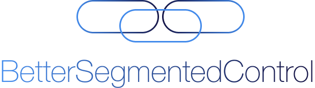
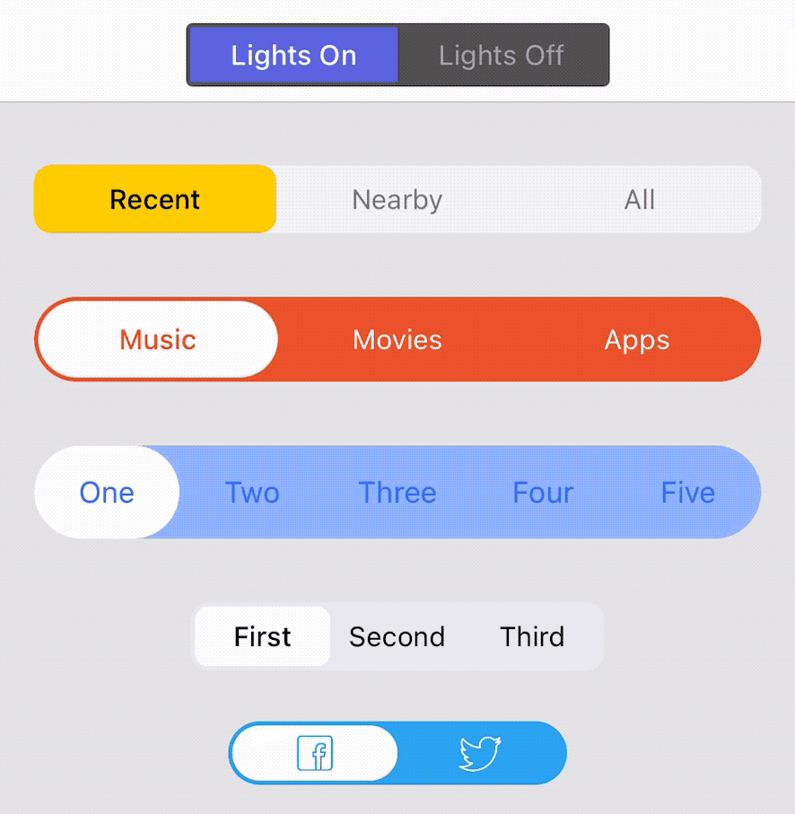
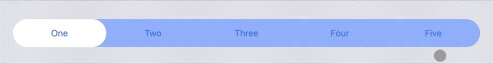

# BetterSegmentedControl


[](http://cocoapods.org/pods/BetterSegmentedControl)
[](http://cocoapods.org/pods/BetterSegmentedControl)
[](http://cocoapods.org/pods/BetterSegmentedControl)

<br />
<br />
<p align="center">
  
</p>
<br />

`BetterSegmentedControl` is an easy to use, customizable replacement for
`UISegmentedControl` and `UISwitch` written in Swift.

## Features

- [x] Can be used as a segmented control or switch
- [x] Plethora of customizable options from colors to insets, radii and
animations
- [x] Use text or icons as segments, or add your own custom segments
- [x] Designable straight in Interface Builder
- [x] Accessibility support
- [x] iPad cursor support
- [x] Customizable behavior
- [x] Right-to-left languages support
- [x] Fully tested


## Examples

#### iOS


#### iPad cursor




## Requirements

- iOS 9.0+
- Xcode 8+


## Installation

### Swift Package Manager

BetterSegmentedControl is available through Swift Package Manager. To install
it, simply go to Xcode under `File > Swift Packages > Add Package Dependency...`

### CocoaPods

BetterSegmentedControl is available through [CocoaPods](http://cocoapods.org).
To install it, simply add the following line to your Podfile:

```ruby
# Swift 5.1
pod 'BetterSegmentedControl', '~> 2.0'

# Swift 4
pod 'BetterSegmentedControl', '1.0'

# Swift 3 / Objective-C
pod 'BetterSegmentedControl', '0.8'
```

### Manually

If you prefer not to use CocoaPods or Swift Package Manager, you can integrate
BetterSegmentedControl into your project manually.


## Usage

```swift
let control = BetterSegmentedControl(frame: CGRect(x: 16.0,
                                                   y: 0,
                                                   width: view.bounds.width - 32.0,
                                                   height: 44.0))
view.addSubview(control)
```

You can find several ways of using it, such as by designing it in a Storyboard
file or creating it in code in the example project.

To run the example project, clone the repo, and run `pod install` from the
Example directory first.


## Contribution

Feel free to submit Pull Requests or send me your feedback and suggestions!

Logo by [Guillaume Galante][guillaume-dribble].

[guillaume-dribble]: https://dribbble.com/guillaumegalante

## Author

George Marmaridis

- https://github.com/gmarm
- https://twitter.com/gmarmas
- https://www.linkedin.com/in/gmarm
- gmarmas@gmail.com


## License

BetterSegmentedControl is available under the MIT license. See the LICENSE file
for more info.
